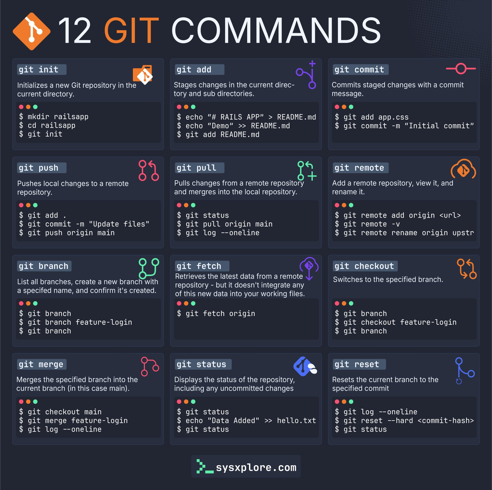

# dev-wiki

Repositorio de documentación técnica para desarrollos propios.
Enlaces de interes:
https://github.com/techiescamp/devops-tools?tab=readme-ov-file

## Estructura

```
docs/
	dotnet/
		basics.md
		ef-core.md
		dependency-injection.md
		design-patterns.md
		architectures.md
	angular/
		cli-commands.md
		components.md
	typescript/
		tips.md
	sql/
		queries.md
		optimization.md
	github/
		git-commands.md
		workflows.md
README.md
```

## Navegación rápida

- [Comandos de Git](docs/github/git-commands.md)

  

- [Cheatsheet SQL](docs/sql/queries.md)

  

- [Tips de TypeScript](docs/typescript/tips.md)
- [Angular CLI](docs/angular/cli-commands.md)
- [EF Core](docs/dotnet/ef-core.md)
- [Inyección de Dependencias](docs/dotnet/dependency-injection.md)
- [Patrones de Diseño](docs/dotnet/design-patterns.md)
- [Arquitecturas .NET](docs/dotnet/architectures.md)

> **Tip:** Las imágenes de cheatsheets se visualizan automáticamente en GitHub y VS Code si están en la misma carpeta que el archivo Markdown correspondiente. Puedes consultarlas directamente desde la web del repositorio.

---

Puedes contribuir agregando nuevos archivos Markdown en la carpeta correspondiente o mejorando los existentes.
